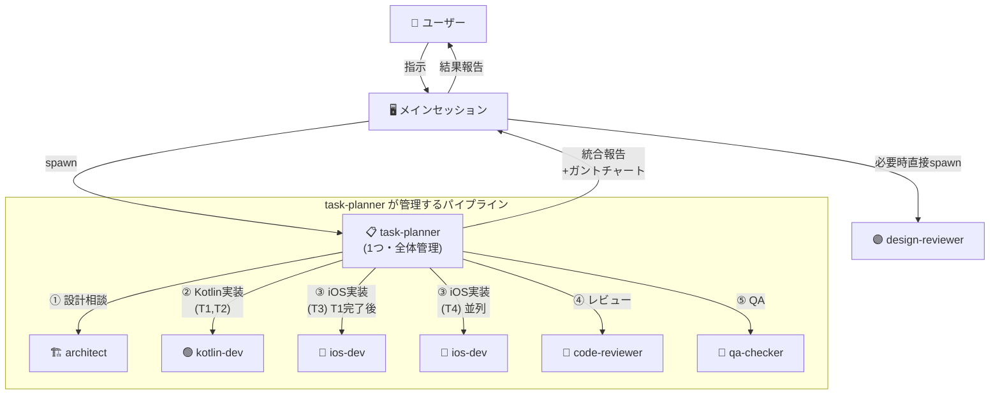

# InspireHub 開発自動化基盤 構築計画

## Context

InspireHub MobileのPhase 1完成（期限2/9）に向けて、エージェントチーム・スキル・カスタムエージェントを整備し、開発を自動化する。実装の前にまず自動化基盤を構築する。

### 決定事項

- **Skills**: Skill Creatorフォーマット（YAML frontmatter + markdown）で作成
- **Architect**: kotlin-devとは別に、KMPアーキテクチャ全体（Kotlin+iOS）を理解するアーキテクトエージェントとして作成
- **Code Reviewer**: 統合型。Kotlin+iOS両方を理解し、KMP境界の整合性を重点レビュー
- **Rules**: 既存の`ios-swift.md`と`kotlin-kmp.md`で十分。追加なし
- **Memory**: 全エージェントに`memory: project`を設定（`.claude/agent-memory/<name>/`に保存、MEMORY.mdがシステムプロンプトに自動読み込み）

---

## 組織図



**ポイント**:

- **メインセッション**: ユーザーとの対話窓口。task-plannerを1つspawn
- **task-planner**: 全タスクの統合ガントチャートを持ち、パイプライン全体を自律管理
- **specialist agents**: task-plannerが依存順にspawn。並列可能なタスクは同時起動
- **design-reviewer**: UIレビュー特化。メインセッションから直接spawnも可

---

## Part 1: Custom Agents（7つ）

ディレクトリ: `.claude/agents/`

### 1. `kotlin-dev.md`

```yaml
---
name: kotlin-dev
description: Use this agent when implementing Kotlin code in the shared/ layer.
model: inherit
color: green
memory: project
tools: ["Read", "Edit", "Write", "Grep", "Glob", "Bash"]
---
```

**役割**: shared層のKotlinコード実装に特化

**専門知識**:

- MVVM + Store Pattern: `ViewModel → Store → Repository → DataSource`
- KMP-ObservableViewModel: `MutableStateFlow(viewModelScope, value)`, `@NativeCoroutinesState`, `viewModelScope.launch`
- KMPの`MutableStateFlow`は`com.rickclephas.kmp.observableviewmodel.MutableStateFlow`を使用（kotlinx版は禁止）
- `stateIn`も`com.rickclephas.kmp.observableviewmodel.stateIn`を使用
- DI: Koin（Store=singleOf, Repository=single, ViewModel=factoryOf）
- テスト: Fake実装（MockK禁止）、MainDispatcherRule継承、Turbine `.test {}`
- Bash制限: `./gradlew :shared:testDebugUnitTest` のみ

**作業スコープ**: `shared/src/` 配下のみ

---

### 2. `ios-dev.md`

```yaml
---
name: ios-dev
description: Use this agent when implementing iOS SwiftUI code in the iosApp/ directory.
model: inherit
color: blue
memory: project
tools: ["Read", "Edit", "Write", "Grep", "Glob", "Bash",
        "mcp__xcode__XcodeRead", "mcp__xcode__XcodeWrite", "mcp__xcode__XcodeUpdate",
        "mcp__xcode__XcodeGrep", "mcp__xcode__XcodeGlob",
        "mcp__xcode__BuildProject", "mcp__xcode__GetBuildLog",
        "mcp__xcode__RenderPreview", "mcp__xcode__XcodeRefreshCodeIssuesInFile"]
---
```

**役割**: iOS SwiftUIコード実装に特化

**専門知識**:

- ターゲット: iOS 18+（iOS 26 API推奨）
- 非推奨API禁止: `NavigationView` → `NavigationStack`, `@StateObject` → `@StateViewModel`, `.onChange(of:) { newValue in }` → `.onChange(of:) { oldValue, newValue in }`
- KMP-ObservableViewModel: `@StateViewModel`, `@ObservedViewModel` でKotlin VMを直接使用
- ViewModelWrapper作成禁止
- `import KMPObservableViewModelSwiftUI`
- Kotlin StateFlowの型キャスト: `viewModel.nodes as? [Node] ?? []`
- SwiftUI Preview対応: PreviewDataを使ったプレビュー定義

**作業スコープ**: `iosApp/` 配下のみ

---

### 3. `architect.md`

```yaml
---
name: architect
description: Use this agent for architecture decisions, cross-platform design, build problems, and technology selection.
model: inherit
color: yellow
memory: project
tools: ["Read", "Grep", "Glob", "Bash", "WebSearch", "WebFetch",
        "mcp__context7__resolve-library-id", "mcp__context7__query-docs"]
---
```

**役割**: KMPプロジェクト全体のアーキテクト（Kotlin + iOS横断で設計判断）

**専門知識**:

- MVVM + Store Patternの設計判断・レイヤー分割
- expect/actualパターンの設計
- Gradle設定（libs.versions.toml, build.gradle.kts）
- iOS Shared.framework生成・リンク
- KMP-ObservableViewModel / KMP-NativeCoroutines の設定・トラブルシューティング
- Ktor Client のプラットフォーム別設定（OkHttp/Darwin）
- Koin マルチプラットフォームDI
- ライブラリ互換性評価（Context7で最新ドキュメント参照）
- ビルドエラー解析（Android/iOS両方）
- CI/CD戦略（Xcode Cloud + Gradle + GitHub Actions）
- SPMマルチモジュール化の設計（`docs/design/spm_multimodule_architecture.md`参照）

**作業スコープ**: プロジェクト全体（コード変更はしない、分析・設計提案のみ）

---

### 4. `qa-checker.md`

```yaml
---
name: qa-checker
description: Use this agent to verify code quality, check bug fix status, and run tests.
model: inherit
color: red
memory: project
tools: ["Read", "Grep", "Glob", "Bash",
        "mcp__xcode__BuildProject", "mcp__xcode__GetBuildLog",
        "mcp__xcode__XcodeListNavigatorIssues"]
---
```

**役割**: コード品質検証・バグ検出・テスト実行

**専門知識**:

- `docs/qa_checklist.md` のバグ一覧を基準にコード検証
- Kotlin単体テスト: `./gradlew :shared:testDebugUnitTest`
- iOSビルド確認: Xcode MCPツールで
- ルール違反自動検出:
  - Grep `NavigationView` → ルール違反
  - Grep `@StateObject` (KMP VM用) → ルール違反
  - Grep `.onChange(of:.*\{.*newValue in` → 旧シンタックス
- 検証結果をマークダウンテーブルで報告

**作業スコープ**: 読み取り専用 + ビルド/テスト実行

---

### 5. `design-reviewer.md`

```yaml
---
name: design-reviewer
description: Use this agent to review UI implementation against design specifications and SwiftUI design guide.
model: inherit
color: purple
memory: project
tools: ["Read", "Grep", "Glob",
        "mcp__xcode__XcodeRead", "mcp__xcode__RenderPreview",
        "mcp__apple-docs__search_apple_docs", "mcp__apple-docs__get_apple_doc_content"]
---
```

**役割**: UIの設計書準拠チェック・デザイン改善提案・HIG準拠・Apple審査対応

**参照ドキュメント**:

- `docs/design/画面設計_ネイティブアプリ.md` — 画面仕様
- `docs/design/swiftui_design_guide.md` — デザインシステム（色、タイポグラフィ、スペーシング、アニメーション、ハプティクス）
- `docs/design/ペルソナ.md` — UX原則
- `docs/design/link_expression_proposals.md` — リンク表現提案
- Apple Human Interface Guidelines（Apple Docs MCPで参照）

**専門知識**:

- **Human Interface Guidelines (HIG)**: iOS/iPadOS/macOSの各プラットフォームのデザイン原則、ナビゲーションパターン、コンポーネント使用ガイドライン
- **App Store審査ガイドライン**: リジェクトされやすいUI/UXパターンの検出、プライバシー要件、コンテンツポリシー準拠
- **iOS標準コンポーネント**: SF Symbols、システムカラー、標準ジェスチャー、アダプティブレイアウト

**レビュー観点**:

- カラーパレット準拠（Primary: Blue, Accent: Orange, Issue: Orange badge, Idea: Yellow badge）
- タイポグラフィ準拠（largeTitle.bold, title2.bold, headline, body, caption）
- スペーシング準拠（4pt基準）
- アクセシビリティ（Dynamic Type, VoiceOver, 44pt touch targets, WCAG AA）
- エンゲージメントファネル（View → React → Comment → Post）
- HIG準拠（ナビゲーション構造、モーダル使用、タブバー設計）
- App Store審査リスク（ログイン要件、プライバシーラベル、最小機能要件）

**作業スコープ**: 読み取り + Preview確認のみ（コード変更なし）

---

### 6. `code-reviewer.md`

```yaml
---
name: code-reviewer
description: Use this agent to review code changes across Kotlin and iOS layers, with focus on KMP boundary integrity.
model: inherit
color: cyan
memory: project
tools: ["Read", "Grep", "Glob",
        "mcp__xcode__XcodeRead", "mcp__xcode__XcodeGrep",
        "mcp__xcode__BuildProject", "mcp__xcode__GetBuildLog",
        "mcp__github__pull_request_read", "mcp__github__get_file_contents"]
---
```

**役割**: Kotlin+iOS統合コードレビュー（KMP境界を重点的に検査）

**レビュー重点項目**:

1. **KMP境界の整合性**:
   - Kotlin StateFlowに`@NativeCoroutinesState`が付いているか
   - iOS側で`@StateViewModel`/`@ObservedViewModel`を正しく使っているか
   - StateFlowの型キャスト（`as? [Type] ?? []`）が安全か
   - ViewModelWrapper禁止ルールが守られているか

2. **Kotlinルール** (`.claude/rules/kotlin-kmp.md`):
   - `com.rickclephas.kmp.observableviewmodel.MutableStateFlow` を使用しているか
   - `viewModelScope.launch`は`com.rickclephas.kmp.observableviewmodel.launch`か
   - テストでMockKを使っていないか

3. **iOSルール** (`.claude/rules/ios-swift.md`):
   - `NavigationView`が使われていないか
   - `.onChange`の旧シンタックスがないか
   - iOS 16以降の非推奨Warningがないか

4. **アーキテクチャ準拠**:
   - MVVM + Store Patternに従っているか
   - ビジネスロジックがshared/に、UIがcomposeApp/またはiosApp/にあるか
   - DI設定（Koin）が正しいか

**作業スコープ**: 読み取り専用 + PR/diffレビュー

---

### 7. `task-planner.md`

```yaml
---
name: task-planner
description: Use this agent to plan tasks, coordinate agent teams, and manage implementation pipelines for a feature or work scope.
model: inherit
color: white
memory: project
tools: ["Read", "Grep", "Glob", "Bash", "Task", "SendMessage", "TodoWrite",
        "TeamCreate", "TaskOutput",
        "mcp__github__issue_write", "mcp__github__issue_read",
        "mcp__github__list_issues", "mcp__github__add_issue_comment",
        "mcp__github__search_issues"]
---
```

**役割**: タスク分解・依存関係分析・ガントチャート作成 + チーム管理・パイプライン実行 + GitHub Issueベースのタスク管理

**使い方**: メインセッションが**1つの**task-plannerをspawnする。task-plannerが全タスクの統合ガントチャートを作り、specialist agentsを依存順に起動してパイプラインを回す。並列化はspecialist agent単位で行う。

```text
メインセッション
  └→ task-planner（1つ・全体管理）
       │
       │ ← 統合ガントチャート（全機能・全タスク）
       │
       ├→ kotlin-dev: T1(Node model拡張), T2(MockData修正)
       ├→ ios-dev: T3(リアクション実装) ← T1完了後
       ├→ ios-dev: T4(マイページ改修) ← T1と並列可
       ├→ code-reviewer: 全変更レビュー
       └→ qa-checker: 全体QA
```

**パイプライン手順**:

1. **計画フェーズ**:
   - `docs/design/機能一覧.md` と `docs/qa_checklist.md` を読み込み
   - 既存コードをGrep/Readで調査し、実装状況と残作業を特定
   - タスクを細粒度に分解（1タスク = 1エージェントが1セッションで完了できる単位）
   - 依存関係を分析（Kotlin shared層 → iOS UI層 の順序制約）
   - Mermaidガントチャートを出力

2. **GitHub Issue作成フェーズ**:
   - 分解したタスクをGitHub Issueとして作成（`mcp__github__issue_write`）
   - ラベル: `phase-1`, `kotlin`, `ios`, `bug`, `feature`, `review`, `qa`
   - Issue本文に: 要件、対象ファイル、受け入れ基準、依存Issue番号を記載
   - 既存のIssueと重複しないか`search_issues`で事前確認
   - qa_checklistのBUG-IDがある場合はIssue本文に紐付け記載

3. **実行フェーズ**:
   - TeamCreateでチーム作成
   - 依存順にspecialist agentをspawn（architect → kotlin-dev → ios-dev）
   - spawn時にGitHub Issue番号を渡す（コミットメッセージで `closes #XX` を使用）
   - 各タスク完了時にIssueをclose（`issue_write` method: update, state: closed）
   - 進捗をIssueコメントで記録（`add_issue_comment`）

4. **検証フェーズ**:
   - code-reviewerにレビュー依頼
   - qa-checkerにQA実行依頼
   - 指摘があれば該当devに修正依頼（Issue reopenまたは新Issue作成）

5. **サーバチーム依頼フェーズ**（該当する場合のみ）:
   - API仕様の変更・追加が必要な場合、サーバリポジトリ（`WITS-ISLAND/inspirehub`）にIssueを作成
   - ラベル: `mobile-request`
   - Issue本文に: 必要なAPI仕様、期待するレスポンス形式、モバイル側のIssue番号を記載
   - 作成後、モバイル側のIssueにもサーバIssueへのリンクをコメント追加
   - サーバ対応待ちの間はモック実装で進行

6. **報告フェーズ**:
   - 完了タスク一覧（Issue番号付き）・残課題・テスト結果をまとめてメインセッションに報告
   - サーバチームへの依頼Issue一覧（あれば）を報告に含める

**出力フォーマット（計画フェーズ）**:

```markdown
## タスク一覧

| ID | タスク | 担当 | 依存 | 見積 |
|----|--------|------|------|------|
| T1 | Node modelにreaction fields追加 | kotlin-dev | - | S |
| T2 | MockNodeDataSourceにparentNodeId追加 | kotlin-dev | T1 | S |
| T3 | DetailViewのリアクションボタン実装 | ios-dev | T1 | M |

## ガントチャート

\```mermaid
gantt
    title Phase 1 残作業
    dateFormat YYYY-MM-DD
    section Kotlin shared
    T1 Node model拡張 :t1, 2025-02-07, 1d
    T2 MockData修正    :t2, after t1, 1d
    section iOS UI
    T3 リアクション実装 :t3, after t1, 1d
\```
```

**specialist agentへのコンテキスト受け渡しガイドライン**:

task-plannerがspecialist agentをspawnする際、以下を必ずプロンプトに含める:

1. **GitHub Issue番号**: 対応するIssue番号（コミットで `closes #XX` に使用）
2. **対象ファイルパス**: 修正すべきファイルの絶対パス
3. **要件**: 何を実装・修正するかの具体的な説明
4. **参照ファイル**: 既存の類似実装や参考コードのパス
5. **受け入れ基準**: 完了の判定条件
6. **依存情報**: 前のタスクで変更されたファイル・API（あれば）

例:

```text
kotlin-devに渡すプロンプト例:
「Node.ktにリアクションフィールドを追加してください。（GitHub Issue #15）
- 対象: shared/src/commonMain/kotlin/.../domain/model/Node.kt
- 参考: 既存のlikeCount/isLikedフィールドと同じパターン
- 受け入れ基準: ビルド成功 + 既存テストがパス
- コミットメッセージに closes #15 を含めること」
```

**参照ドキュメント**:

- `docs/design/機能一覧.md` — Phase 1機能スコープ
- `docs/qa_checklist.md` — バグ一覧
- `docs/architecture.md` — アーキテクチャ概要

---

## Part 2: Skills（5つ）

ディレクトリ: `.claude/skills/`

Skill Creatorフォーマット（YAML frontmatter + markdown）で作成。

### 1. `/qa-check` — QA検証スキル

**ファイル**: `.claude/skills/qa-check/SKILL.md`

```yaml
---
name: qa-check
description: QAチェックリストに対して現在のコードの修正状況を自動検証し、レポートを出力する
user-invocable: true
argument-hint: "[BUG-ID|all] (例: BUG-004 or all)"
allowed-tools: Read, Grep, Glob
---
```

**処理フロー**:

1. `docs/qa_checklist.md` を読み込み、バグ一覧を解析
2. 引数で指定されたバグID（またはall）を対象に
3. 各バグの対応ファイルをGrep/Readで検査
4. 修正済み / 未解決 / 一部対応 のステータスを判定
5. レポートをマークダウンテーブルで出力

---

### 2. `/build` — ビルド確認スキル

**ファイル**: `.claude/skills/build/SKILL.md`

```yaml
---
name: build
description: Kotlin shared層とiOS/Androidのビルドを実行し、エラー・警告を報告する
user-invocable: true
argument-hint: "[ios|android|shared|all] (デフォルト: all)"
allowed-tools: Bash, Read, Grep, mcp__xcode__BuildProject, mcp__xcode__GetBuildLog
---
```

**処理フロー**:

1. 引数に応じてビルドコマンドを実行
   - `shared`: `./gradlew :shared:testDebugUnitTest`
   - `android`: `./gradlew :composeApp:assembleDebug`
   - `ios`: Xcode MCPの`BuildProject`
   - `all`: 上記すべて
2. エラー/警告を収集・分類
3. 修正アドバイスを提示

---

### 3. `/fix-bug` — バグ修正スキル

**ファイル**: `.claude/skills/fix-bug/SKILL.md`

```yaml
---
name: fix-bug
description: バグIDを指定してQAチェックリストに基づくコード修正を自動実行する
user-invocable: true
argument-hint: "<BUG-ID> (例: BUG-004)"
allowed-tools: Read, Grep, Glob, Edit, Write, Bash
---
```

**処理フロー**:

1. `docs/qa_checklist.md` から指定バグIDの詳細情報を取得
2. バグに関連するファイルを特定し読み込み
3. `.claude/rules/` のルールを参照して修正方針を決定
4. コード修正を実行
5. 関連テストがあれば実行して検証
6. 修正サマリーを報告

---

### 4. `/design-review` — デザインレビュースキル

**ファイル**: `.claude/skills/design-review/SKILL.md`

```yaml
---
name: design-review
description: 画面設計書とSwiftUIデザインガイドに対して現在の実装の準拠状況をレビューする
user-invocable: true
argument-hint: "[画面名|all] (例: HomeView, DetailView, all)"
allowed-tools: Read, Grep, Glob, mcp__xcode__XcodeRead, mcp__xcode__RenderPreview
---
```

**処理フロー**:

1. `docs/design/画面設計_ネイティブアプリ.md` と `docs/design/swiftui_design_guide.md` を読み込み
2. 引数で指定された画面（またはall）のSwiftUIファイルを検査
3. チェック項目:
   - カラーパレット準拠
   - タイポグラフィ準拠
   - スペーシング準拠
   - コンポーネント構成（画面設計書との差分）
   - アクセシビリティ対応
4. 差分・未実装項目をリスト化
5. 改善提案をレポート出力

---

### 5. `/retro` — 振り返り・効率化スキル

**ファイル**: `.claude/skills/retro/SKILL.md`

```yaml
---
name: retro
description: エージェントの振り返りを実行し、スキル化候補・サブエージェント増設提案・コンテキスト肥大化チェックをレポートする
user-invocable: true
argument-hint: "(引数なし)"
allowed-tools: Read, Grep, Glob
---
```

**処理フロー**:

1. **エージェントメモリ分析**:
   - `.claude/agent-memory/*/MEMORY.md` を全て読み込み
   - 各ファイルの行数をチェック（200行超 → コンテキスト肥大化警告）
   - 「Repeated Patterns」セクションから繰り返しパターンを集約

2. **スキル化候補の検出**:
   - 繰り返しパターンを分析し、スキル化で自動化できるものを提案
   - 既存スキル（`.claude/skills/*/SKILL.md`）と重複しないか確認

3. **サブエージェント増設の判断**:
   - 「Pain Points」セクションから、既存エージェントではカバーできない領域を検出
   - 新エージェント作成の提案（役割・ツール・スコープ）

4. **コンテキスト肥大化チェック**:
   - MEMORY.mdの行数 > 200行: 整理推奨
   - 同じ知見が複数エージェントに重複: 共有ルール化を提案

5. **レポート出力**:

```markdown
## 振り返りレポート

### コンテキスト状況
| エージェント | MEMORY.md行数 | ステータス |
|-------------|--------------|-----------|
| kotlin-dev  | 45行         | ✅ 正常    |
| ios-dev     | 210行        | ⚠️ 要整理  |

### スキル化候補
- [ ] NavigationView → NavigationStack 自動置換（ios-devで3回以上実施）
- [ ] Fakeクラス自動生成（kotlin-devで毎回手動作成）

### サブエージェント増設提案
- なし（現状の7エージェントで十分カバー）

### ルール追加提案
- [ ] 「タグ入力UIにはFlowLayoutを使う」を ios-swift.md に追加
```

**エージェントメモリ規約**: 各エージェントのMEMORY.mdに以下のセクションを維持する:

```markdown
## Repeated Patterns
（繰り返し行った作業パターン）

## Pain Points
（既存の仕組みでは解決しにくかった課題）

## Lessons Learned
（学んだ知見・ベストプラクティス）
```

---

## Part 3: 作成するファイル一覧

```text
.claude/
├── agents/                          # 新規作成
│   ├── kotlin-dev.md               # Kotlin shared層 開発
│   ├── ios-dev.md                  # iOS SwiftUI 開発
│   ├── architect.md               # アーキテクト（KMP横断設計）
│   ├── qa-checker.md               # QA検証
│   ├── design-reviewer.md          # デザインレビュー
│   ├── code-reviewer.md            # コードレビュー（統合型）
│   └── task-planner.md              # タスク分解・ガントチャート
├── skills/
│   ├── interview/                   # 既存
│   ├── qa-check/                    # 新規作成
│   │   └── SKILL.md
│   ├── build/                       # 新規作成
│   │   └── SKILL.md
│   ├── fix-bug/                     # 新規作成
│   │   └── SKILL.md
│   ├── design-review/              # 新規作成
│   │   └── SKILL.md
│   └── retro/                       # 新規作成
│       └── SKILL.md
└── rules/                           # 既存（変更なし）
    ├── ios-swift.md
    └── kotlin-kmp.md
```

**合計**: 20ファイル作成（Agent 7 + Skill 5 + Memory初期テンプレート 7 + CLAUDE.md更新 1）

---

## Part 4: 実装順序

### Phase A: ディレクトリ準備

1. `.claude/agents/` ディレクトリ作成
2. Skillディレクトリ5つ作成

### Phase B: Agents作成（7ファイル）— 並列実行可能

1. `kotlin-dev.md`
2. `ios-dev.md`
3. `architect.md`
4. `qa-checker.md`
5. `design-reviewer.md`
6. `code-reviewer.md`
7. `task-planner.md`

### Phase C: Skills作成（5ファイル）— Skill Creatorフォーマット準拠

1. `/qa-check` SKILL.md
2. `/build` SKILL.md
3. `/fix-bug` SKILL.md
4. `/design-review` SKILL.md
5. `/retro` SKILL.md

### Phase C2: エージェントメモリ初期テンプレート作成

各エージェントの初期MEMORY.mdを `.claude/agent-memory/<name>/MEMORY.md` に作成。

テンプレート内容（全エージェント共通）:

```markdown
# <agent-name> Memory

## Repeated Patterns
（まだなし）

## Pain Points
（まだなし）

## Lessons Learned
（まだなし）
```

対象: kotlin-dev, ios-dev, architect, qa-checker, design-reviewer, code-reviewer, task-planner（7ファイル）

### Phase C3: CLAUDE.md更新

`CLAUDE.md` に以下のセクションを追加:

```markdown
## 開発自動化ツール

### カスタムエージェント（`.claude/agents/`）

Task toolでspawnして使用。

| エージェント | 用途 |
|-------------|------|
| kotlin-dev | shared層のKotlin実装 |
| ios-dev | iosApp/のSwiftUI実装 |
| architect | アーキテクチャ設計・技術選定 |
| qa-checker | コード品質検証・テスト実行 |
| design-reviewer | UI設計書準拠・HIG・審査チェック |
| code-reviewer | Kotlin+iOS統合コードレビュー |
| task-planner | タスク分解・ガントチャート・チーム管理 |

### スキル（`.claude/skills/`）

| コマンド | 用途 |
|---------|------|
| /qa-check [BUG-ID\|all] | QAチェックリスト検証 |
| /build [ios\|android\|shared\|all] | ビルド実行・エラー報告 |
| /fix-bug <BUG-ID> | バグ自動修正 |
| /design-review [画面名\|all] | デザインレビュー |
| /retro | 振り返り・効率化提案 |
```

### Phase D: 動作確認

1. `/qa-check all` を実行してバグステータスレポートを確認
2. `/build shared` を実行してKotlinビルド確認
3. Task toolで `code-reviewer` をspawnして既存コードのレビューを実行
4. Task toolで `task-planner` をspawnしてタスク分解+ガントチャートが出力されるか確認

---

## チーム管理の方針

**メインセッション → task-planner（1つ）→ specialist agents** の2段構成。

**ワークフロー**:

1. メインセッションが1つのtask-plannerをspawn（全タスクのスコープを渡す）
2. task-plannerが全タスクの統合計画+ガントチャートを作成
3. task-plannerがTeamCreateでチーム作成、依存順にspecialist agentをspawn（並列可能なものは同時）
4. 全タスク完了後、code-reviewer → qa-checker → 統合報告をメインセッションに返却
5. メインセッションがユーザーに報告

---

## Gitワークフロー

### 基本戦略: git worktreeでブランチ分離

各specialist agentは独自ブランチで作業し、ファイル衝突を防ぐ。

```text
main
  ├→ feature/reaction-model    (kotlin-dev: T1, T2)
  ├→ feature/reaction-ios      (ios-dev: T3) ← T1完了後にmainからbranch
  ├→ feature/mypage-ios         (ios-dev: T4) ← 並列作業可
  └→ feature/phase1-fixes      (統合ブランチ: 最終マージ先)
```

**ルール**:

1. task-plannerがタスク割り当て時に**ブランチ名とGitHub Issue番号を指定**
2. 各specialist agentは指定ブランチに**コミットまで行う**（push前に停止）
3. コミットメッセージに `closes #XX` を含める（例: `feat: リアクションボタン実装 closes #15`）
4. code-reviewerは各ブランチのdiffをレビュー
5. task-plannerが全ブランチの統合（マージ）を指示
6. 最終的なpushは**メインセッションでユーザー承認後**に実行

**worktree運用**:

- task-plannerが `git worktree add` で作業ディレクトリを作成
- 各specialist agentにworktreeのパスを渡す
- 完了後、task-plannerが `git worktree remove` でクリーンアップ

**注意: Xcode MCP + worktreeの互換性**:

- Xcode MCPは開いているXcodeウィンドウ（tabIdentifier）に紐づく
- worktree内の.xcodeprojを別ウィンドウで開けばiOS MCP操作は可能
- ただし`shared/`と`iosApp/`は完全にディレクトリが分離しているため、**同一ブランチ上で作業順序を守る方式でも運用可能**（worktreeは並列作業が多い場合に切り替え）

---

## エラーハンドリング

specialist agentが失敗した場合のtask-plannerの対応方針:

| 状況 | 対応 |
| ---- | ---- |
| ビルドエラー | エラー内容を同じagentに渡して修正を再依頼 |
| テスト失敗 | 失敗テストの詳細を渡して修正を再依頼 |
| 2回連続失敗 | architectに設計相談 → 方針変更後に再実行 |
| 3回連続失敗 | メインセッションにエスカレート（ユーザー判断） |
| レビュー指摘 | 指摘内容を該当devに渡して修正を依頼 |

---

## ユーザーチェックポイント

task-plannerは以下のタイミングで**パイプラインを一時停止し、メインセッションに返却**する。メインセッションがユーザーに確認を取り、回答後に`resume`でtask-plannerを再開する。

### チェックポイント一覧

| タイミング | 内容 | 例 |
| ---- | ---- | ---- |
| 仕様確認 | API仕様の不明点、ドメインモデルの解釈、要件の曖昧さ | 「リアクションの種類は4つで確定？追加予定はある？」 |
| 設計変更 | 既存アーキテクチャへの大きな変更、新パターン導入 | 「Store PatternにReactionStoreを追加する方針で良い？」 |
| サーバ依頼 | サーバ側のAPI変更・追加が必要な場合の確認 | 「リアクションAPIが未実装です。サーバリポジトリにIssueを作成してよいですか？」 |
| 動作確認 | UI実装完了後の見た目確認、一連の機能テスト | 「リアクション機能のUI実装完了。Previewで確認してください」 |
| マイルストーン完了 | 機能単位の実装完了 | 「Kotlin shared層の変更完了。iOS実装に進んで良い？」 |

### フロー

```text
task-planner: パイプライン実行中...
  → チェックポイント検出
  → メインセッションに返却: 「[仕様確認] XXXについて確認が必要です」

メインセッション: ユーザーに質問（AskUserQuestion）
ユーザー: 回答

メインセッション: task-plannerを resume（回答を渡す）
task-planner: 回答を反映してパイプライン再開
```

### task-plannerへの指示

task-planner定義内に以下を含める:

> パイプライン実行中、仕様の不明点・設計上の重要判断・UI動作確認が必要な場合は、作業を一時停止してメインセッションに返却せよ。返却メッセージには「[チェックポイント種別] 確認内容」を明記すること。判断を勝手に進めず、ユーザー確認を優先せよ。

---

## design-reviewerのパイプライン内位置

design-reviewerは**task-plannerのパイプラインには含めない**（デフォルト）。

**起動タイミング**:

1. **メインセッションから直接**: ユーザーが `/design-review HomeView` 等で直接実行
2. **task-plannerから任意で**: UI実装タスク完了後、task-plannerの判断でspawn可能
3. **code-reviewerからの推薦**: コードレビュー中にUI/UXの懸念が見つかった場合、レビュー結果に「design-reviewer推奨」を記載

---

## 検証方法

1. **Skill動作**: 各 `/skill-name` を実行して正しい結果が返るか
2. **Agent動作**: `Task` toolで各エージェントをspawnして、正しいスコープ・ツール制限で動作するか
3. **統合確認**: `task-planner` をspawnして、計画立案 → チーム作成 → specialist起動 → 報告のパイプラインが機能するか
